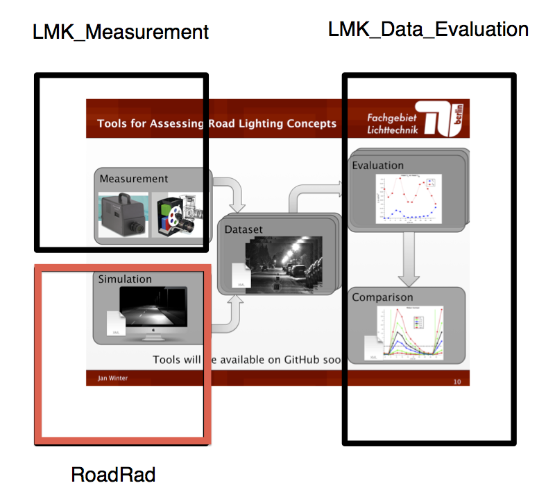
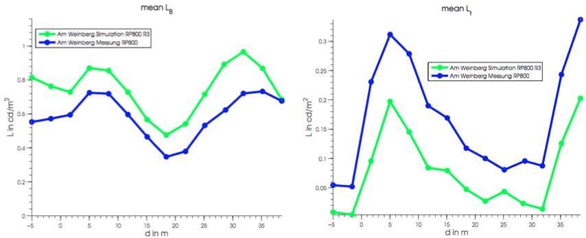

VisibilityLevel-Evaluation-MATLAB
=========

## Measurement / Simulation + Evaluation Framework

This repository is part of a measurement / simulation framework for evaluating contrasts of a small target between two luminaires. It is possible to evaluate the small target visibility level according to ANSI IESNA RP-8-00.

This is the Radiance based simulation part:

## Simulation

This is how the resulting images of the Radiance simulation look like:

The images are actually luminance images and are saved in the pf file format defined by luminance imaging device manufacturer TechnoTeam. The pf files can be loaded into their LabSoft Software.

## Evaluation

The image series can be evaluated in MATLAB with our evaluation framework [VisibilityLevel-Evaluation-MATLAB](https://github.com/fglichttechnik/VisibilityLevel-Evaluation-MATLAB):

## Further Details

For further details have a look into our help file: [Documentation/roadRadHowTo.pdf](Documentation/roadRadHowTo.pdf).

